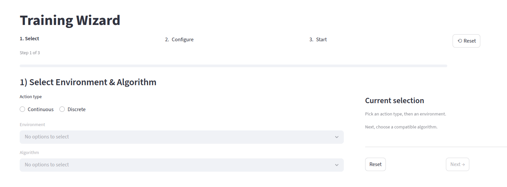
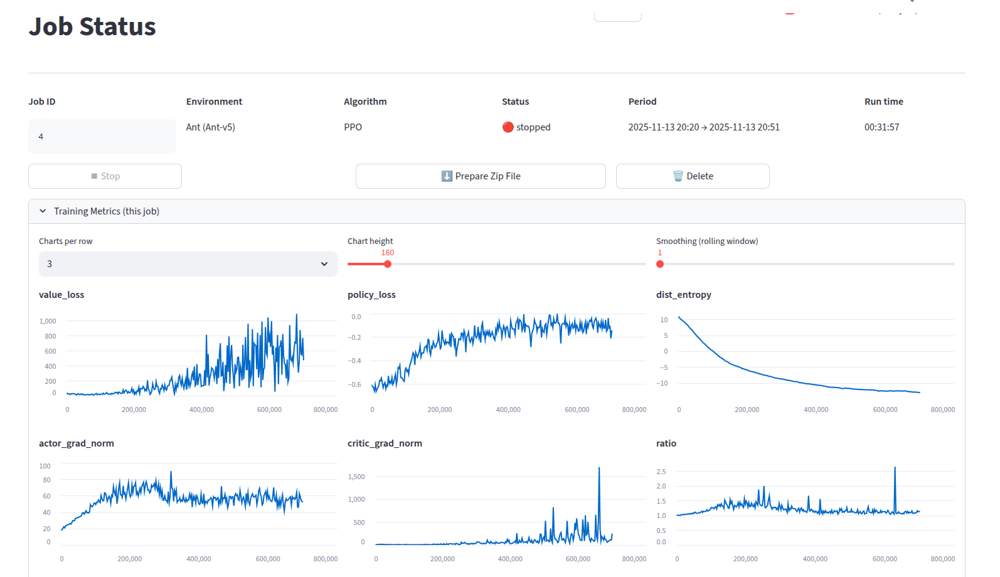

# DRL Wizard
[](https://pypi.org/project/drl-wizard/)
[](LICENSE)

**DRL Wizard** is a lightweight, modular Deep Reinforcement Learning toolkit for training, comparing, and understanding modern RL algorithms across diverse environments. It provides a clean workflow with a FastAPI backend, Streamlit UI, structured logging, and support for multiple concurrent training jobs.

---
 | 

## 🚀 Features

- **Built-in Algorithms**  
  PPO, TRPO, DQN, Double DQN, Dueling DQN, SAC — with more on the way.

- **Environment Support**  
  Works with Gymnasium environments, Atari (ALE), image-based observations, multi-discrete action spaces, and custom environments.

- **Modern Architecture**  
  - FastAPI backend for job orchestration & real-time streaming  
  - Streamlit UI for configuration, dashboards, and experiment comparison  
  - SQLAlchemy repository layer with clean separation of concerns  
  - Pydantic-based configuration system with auto-generated forms  

- **Experiment Management**  
  - Run multiple simulations concurrently  
  - Graceful stop/resume handling  
  - NDJSON logging (train/eval segments)  
  - Manifest tracking and TensorBoard-compatible metrics  
  - Downloadable job archives

- **Extensible**  
  Add new algorithms, environments, or visualization components with minimal boilerplate.

---

## 📦 Installation

```bash
pip install drl-wizard
```

Install with UI:
```bash
pip install drl-wizard[ui]
```

Install with Development:
```bash
pip install drl-wizard[dev]
```

## 🖥️ Running
 - **Running the UI & Backend:**
```bash
drl-wizard-run
```

 - **Running Backend:**
```bash
drl-wizard-api
```

 - **Running UI:**
```bash
drl-wizard-ui
```


## License

This project is licensed under the MIT License — see the [LICENSE](LICENSE) file for details.