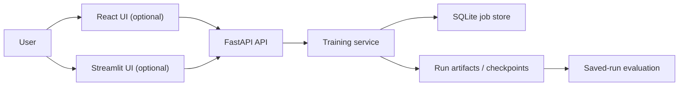

# DRL Wizard - browser-based reinforcement learning training and evaluation

DRL Wizard is a practical interface for running and reviewing deep reinforcement learning experiments without relying on scattered scripts and notebooks.

It combines a FastAPI backend, a Streamlit reference UI, and a React frontend so teams can launch jobs, monitor metrics, evaluate saved checkpoints, and download run artifacts from one place.

## Demo 🎥

Coming soon: a short demo showing the end-to-end workflow across training setup, live metrics, saved-run evaluation, and artifact download.

## Why This Project 🚀

Reinforcement learning workflows often become hard to share once they spread across code, configs, checkpoints, and local notes.

DRL Wizard turns that into a usable product surface by giving teams:

- a browser-based workflow for starting runs
- a cleaner way to monitor training and evaluation progress
- repeatable run tracking with saved artifacts
- a faster path to internal demos, client pilots, and experimentation tools

## What It Solves 💡

- reduces manual experiment handling across scripts and local folders
- makes RL runs easier to review with teammates or clients
- provides a repeatable workflow for training and checkpoint evaluation
- creates a clearer starting point for internal RL platforms and custom deployments

## Who It's For 🧑‍💼

- AI teams building RL proofs of concept
- research labs and experimentation teams
- robotics and simulation projects
- educators and bootcamps teaching applied reinforcement learning
- product teams that need a usable RL operations interface

## What You Can Do ✅

- launch training jobs through the FastAPI backend
- use the included Streamlit UI for a lightweight operator workflow
- use the included React UI for dashboard, training, evaluation, and run management
- browse environments discovered from the current Gymnasium installation
- train with `PPO`, `TRPO`, `A2C`, `DQN`, and `SAC`
- monitor streamed training and evaluation metrics
- stop active jobs and review saved runs
- evaluate saved checkpoints directly from the browser
- render a sample evaluation episode when supported by the environment
- download run artifacts as a ZIP archive

## Key Features ⚙️

- FastAPI backend for orchestration and API access
- Streamlit reference UI for quick setup and operation
- React frontend with dedicated views for training, evaluation, runs, and API status
- SQLite-backed job tracking
- persisted run directories with configs, metrics, and checkpoints
- NDJSON metric streaming for training and evaluation data
- saved-run discovery and checkpoint re-evaluation
- downloadable ZIP archives for completed runs

## Product Highlights 🧠

- **Environment-first workflow**  
  The UI narrows algorithm choices based on the selected environment's action space.

- **Saved-run evaluation**  
  Existing checkpoints can be loaded and tested later without retraining.

- **Two included UIs**  
  Streamlit remains useful as a quick reference interface, while React provides a fuller browser workflow.

- **Local persistence**  
  Job metadata is stored in SQLite and run artifacts are written to disk.

- **Single-node deployment**  
  The current setup is designed for local machines and small internal deployments rather than distributed training clusters.

## Architecture at a Glance 🏗️



## Tech Stack 🛠️

- Python 3.11
- FastAPI
- Streamlit
- React
- Vite
- TypeScript
- SQLite / SQLAlchemy
- Gymnasium
- Docker / Docker Compose

## Quickstart with Docker Compose 🐳

Prerequisites:

- Docker
- Docker Compose

```bash
# API only
docker compose up --build

# API + Streamlit UI
docker compose --profile streamlit up --build

# API + React UI
docker compose --profile react up --build

# API + Streamlit + React together
docker compose --profile streamlit --profile react up --build
```

Access services:

- API: `http://localhost:8000`
- API docs: `http://localhost:8000/docs`
- Streamlit UI: `http://localhost:8501` when the `streamlit` profile is enabled
- React UI: `http://localhost:5173` when the `react` profile is enabled

Notes:

- Compose now persists SQLite data in `./db` and run artifacts in `./runs`.
- The backend database path is configured with `DATABASE_PATH=/app/db/drl.db` in Compose.
- Streamlit talks to the API over the internal Compose network at `http://app:8000`.
- The React container runs the Vite dev server and points to the API with `VITE_API_BASE_URL=http://localhost:8000`.

## Local Development 💻

Use local processes when you want to work directly on the backend or UI layers.

```bash
uv sync --dev
npm install
```

Run the API:

```bash
uv run uvicorn drl_wizard.backend.app:app --host 127.0.0.1 --port 8000 --reload
```

Run the Streamlit UI:

```bash
uv run streamlit run src/drl_wizard/frontend/streamlit_app/home.py
```

Run the React UI:

```bash
npm run dev -- --host 0.0.0.0 --port 5173
```

Run tests:

```bash
uv run pytest
```

## API at a Glance 🔌

Core endpoints:

- `GET /healthz`
- `GET /training_service/environments`
- `GET /training_service/algorithms`
- `GET /training_service/environments/{env_id}/supported_algorithms`
- `POST /training_service/train`
- `GET /training_service/all`
- `GET /training_service/{job_id}`
- `PATCH /training_service/{job_id}/stop`
- `DELETE /training_service/{job_id}`
- `GET /training_service/{job_id}/results/{result_type}/stream`
- `GET /training_service/{job_id}/data/zip`

Saved-run endpoints:

- `GET /training_service/saved_runs?env_id=...`
- `GET /training_service/saved_runs/{run_id}`
- `POST /training_service/saved_runs/{run_id}/evaluate`

## Configuration ⚙️

Common environment variables:

| Variable | Description | Default |
|---|---|---|
| `API_PORT` | API port used by the container command and published port | `8000` |
| `STREAMLIT_PORT` | Streamlit published port | `8501` |
| `REACT_PORT` | React published port | `5173` |
| `DATABASE_PATH` | SQLite database path | `./db/drl.db` locally, `/app/db/drl.db` in Compose |
| `API_BASE_URL` | Base URL used by the Streamlit app | `http://127.0.0.1:8000` |
| `VITE_API_BASE_URL` | Base URL used by the React app | `http://127.0.0.1:8000` |
| `DRL_WIZARD_CORS_ORIGINS` | Comma-separated allowed browser origins | `*` |

## Current Scope 📌

The current repository is positioned as a working RL training platform for local and small-team usage. It already supports training orchestration, saved-run evaluation, streamed metrics, and two browser-facing UIs, while leaving room for broader deployment, authentication, and production hardening later.

## License

This project is licensed under the MIT License. See the [LICENSE](LICENSE) file for details.
